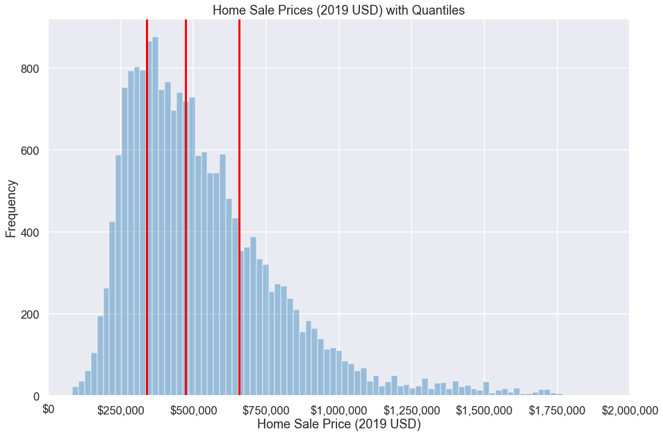
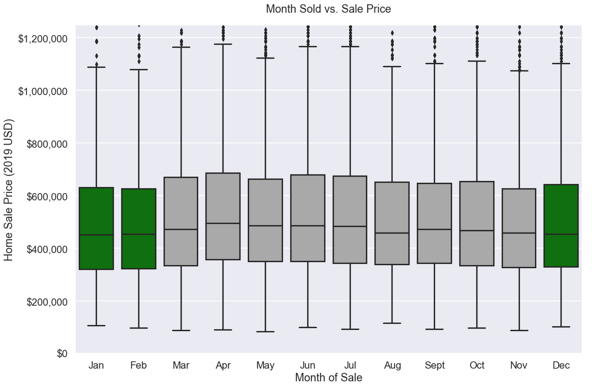
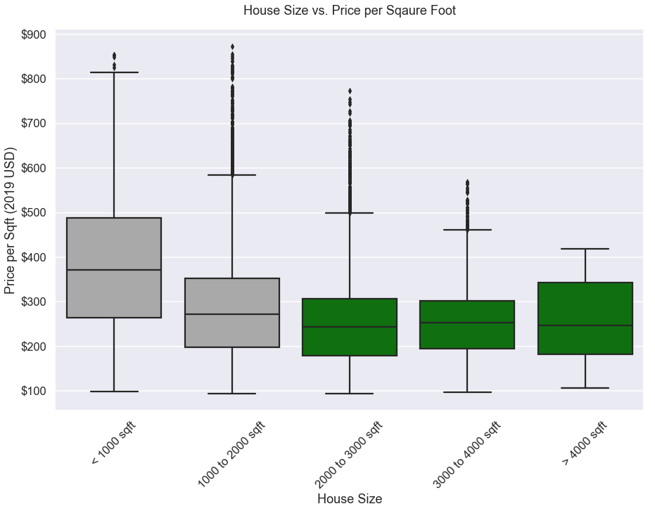
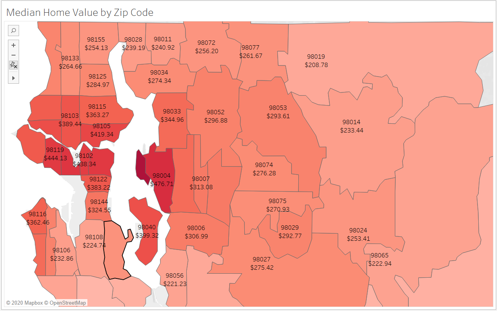

# King County Residential Real Estate Bargain Hunting

## Table of Contents
* [General Info](#general-info)
* [Technologies](#technologies)
* [Insights and Business Recommendations](#insights-and-business-recommendations)
* [Further Studies](#further-studies)

## General Info
This project was assigned as the final project for Module 2 (Statistics and Linear Regression) in Flatiron School's Immersive Data Science Program. My self-defined goal of the project is to analyze home sale data over a two year period (2015 and 2016) and find out how a savvy residential real estate investor can gain a foothold in this hot market. 

Housing prices in King County, WA have been exploding over the past decade due to many factors including the availability of great jobs, a rich culture, and a plethora of outdoor recreation opportunities in the surrounding areas. It is now harder than ever for house hunters to find a bargain in what seems like is a perpetual sellers' market.

My goal in this project was to determine where, when, and what types of houses are still available at decent prices and develop a multiple linear regression model capable of giving the patient investor an indication whether or not they may be looking at a bargain. Meeting this goal required careful data cleaning, exploratory data analysis, thoughtful feature engineering, and finally an iterative approach to mutliple regression modelling.

With a median home value of $472k (during the 2015-2016 time period, adjusted for inflation) prices are high but there are still deals to be found. 

## Technologies
This project was created using the following languages and libraries. An environment with the correct versions of the following libraries will allow re-production and improvement on this project. 

* Python version: 3.6.9
* Matplotlib version: 3.0.3
* Seaborn version: 0.9.0
* Pandas version: 0.24.2
* Numpy version: 1.16.2
* Statsmodels version: 0.9.0
* Scipy version: 1.2.1
* Sklearn version: 0.20.3
* Tableau Public version: 2020.0

## Insights and Investment Recommendations

### Buy During the Right Time of Year
Perhaps the simplest way to find a good deal is to shop when the market get's cool in the winter months. In fact analysis showed that home buyers paid a median amount of $496k in April compared to $452k in January - that's nearly a 10% premium!  

### Buy the Right Size Home
Home sizes below 2,000 sf appeared to be the most expensive. Buying a house with at least 2,000sf of living space makes sense for multiple reasons. 

1. You'll get the best deal on a square foot basis. 
2. If you wish to make a rental out of the unit having at least 2,000 sf will make your property ideal for young families - typical renters. 
3. If you wish to remodel your cost on a sf basis will be less than it would be on a smaller home. Contractors typically charge a premium on smaller jobs to make them worth their time and you can save money buying material in bulk on a larger job. 

### Shop in the Right Neighborhoods
By conducting geographical analysis with the assistance of Tableau Public and using my intuition as a native Washtonian I was able to narrow down three particular zip codes of interest. Each of these areas are charming in their own way, a reasonable distance to business hubs, and have average to excellent public schools. I would highly recommend investigating these areas further. In no particular order, they are listed below. 

1. Snoqualmie / North Bend area (98065) - this is a beautiful area which is growing rapidly as the Seattle metro area expands. Prices are currently reasonable with a median home value of 222 USD/sf. You are looking at a 30min commute to Redmond or Bellevue, and a 35min commute to downtown Seattle.
2. Renton area (98056) - this is an area with reasonable commute times to multiple business hubs. You area 21min from Bellevue, 28min from Redmond, and 22min from Seattle. Median home prices are 222 USD/sf.
3. Kenmore area (98028) - this is another beatiful area with great views and reasonable commute times. You are 27min from Redmond or Bellevue, and 35min from Seattle. Median home prices are 239 USD/sf.

## Final Regression Model
In summary I am somewhat pleased with the final model though there are clearly unseen factors at play here which contribute to home valuation and have not been accounted for.

**The good**

1. The final model has an r-squared-adjusted value of 0.79 and utilizes twenty-two features. Furthermore, using only the top six features, our model has an r-squared-adjusted value of 0.77 which means that we may explain 77% of the variance in home prices in the King County area using just those six features which is quite impressive.
2. Our model performs more or less equally well with both test and train datasets implying we have certainly not overfit our model.
3. Normality and homoskedasticity of residuals assumptions are met.

**The bad**

1. Our RMSE is $127k USD! This is not very confidence inspiring considering that the median home value of our analyzed dataset is $472k USD.
2. We eliminated quite a bit of outliers to create a model capable of performing well with our remaining dataset. Our final, trimmed dataset contained only 91% of the original values and our model's accuracy is only proven below the $1.8MM USD price point. However, for our purposes and our price range for investments this is perfectly acceptable. 

## Further Studies
As with all data science projects there is always more work to do. Most notably I've been considering the following. 

### Look at the School Districts
Many wealthy parents are willing to pay more in housing expenses in order to send their kids to top schools. I would be interested in finding data regarding highest rated school districts in the King County area and relate those to our zip code data. We could then create a feature such as 'public_schools' which would assign a rank Tier 1, Tier 2, etc. to each zip code based on the quality of it's public school system.

### Where Are the High Paying Jobs Moving
The city of Seattle is becoming less business friendly with it's tax policies and it may begin to lose larger companies which will seek to open offices outside of the city limits. I suspect many companies, existing and new, will begin to move employees and offices to more business friendly districts such as Bellevue and Redmond as companies such as Amazon and Microsoft have done in recent years. I would be curious to investigate this further and try to determine if there are any other up and coming business hubs I am unaware of. 

### Analyze a Longer Time Frame
I would be very interested in seeing the housing prices over a longer time period. For example, it would be very interesting to be able to see housing price trends over a geographic area over a period of time. This could help answer questions such as which areas of King County are beginning to trend upwards.

### Utilize Advanced Regression Methods for Final Model
More advanced models exist which may prove to be more accurate in determing home values. For example, enseemble methods such as gradient boosted decision trees could improve our prediction accuracy. Furthermore, we never really risked overfitting our model so it could be helpful to test those boundaries by introducing more features and/or polynomials to our model, test for overfitting, and then attempt to use a regularized model such as ridge or lasso regression to account for overfitting. Another option would be to not eliminate the outliers and use robust regression - this would be especially useful if we needed to create a model which will help predict outlier datapoints as well. The options for further analysis in this regard are plentiful.
